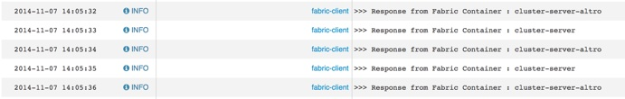

Esempio per esporre un servizio tramite il component fabric:
===

I profili da utilizzare sono:

1. example-camel-cluster.client
1. example-camel-cluster.server

Il server espone un servizio http ed il client lo richiama ogni secondo.

Nel log del server è possibile vedere la chiamata, ma le informazioni interessanti si vedono dal client che scrive nei log il nome del container del server che gli ha risposto.

Interessante per mostrare la creazione di più container server a caldo ed il load balancing delle chiamate effettuato in automatico dal componente **fabric:**

