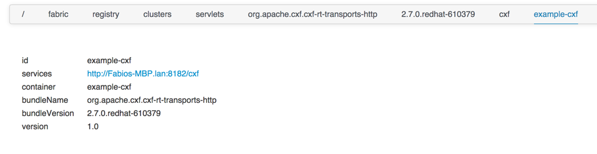

Esempio per esporre un servizio CXF tramite una rotta camel:
===

Il profilo da utilizzare è:

1. example-camel-cxf

Espone un servizio CXF esegue il log della richiesta e risponde con la costante "Hello".

``` html
<route xmlns="http://camel.apache.org/schema/spring" id="fabric-camel-cxf">
  <from uri="cxf:bean:greeterEndpoint"/>
  <to uri="log:requests"/>
  <transform>
    <constant>Hello</constant>
  </transform>
</route>
```

Dal registry di zookeeper si può vedere il servizio esposto da CXF (è una uri jetty)


CXF espone l'interfaccia Greeter senza bisogno di implementazione

``` Java
@WebService
public interface Greeter {

	public String greet();

}
```
