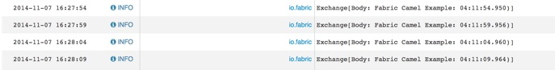

Esempio di comunicazione tramite un broker AMQ
===

Il profilo da utilizzare è:

1. example-camel-mq

Richiede un broker AMQ disponibile, altrimenti il container rimane in attesa.

Il profile crea due semplice rotte camel,
1. esegue un timer ogni 5 secondi, manipola il contenuto del messaggio e lo invia ad una componente AMQ sulla coda _camel-test_
1. riceve i messaggi dalla coda _camel-test_ e ne scrive il contenuto sul log.

``` html
    <route id="route1">
      <from uri="timer://foo?period=5s"/>
      <setBody>
        <simple>Fabric Camel Example: ${date:now:hh:MM:ss.SSS})</simple>
      </setBody>
      <to uri="amq:queue:camel-test"/>
    </route>

    <route id="route2">
      <from uri="amq:queue:camel-test"/>
      <to uri="log:io.fabric?level=INFO&amp;showExchangePattern=false&amp;showBodyType=false"/>
    </route>
```

Immagine dal log:

