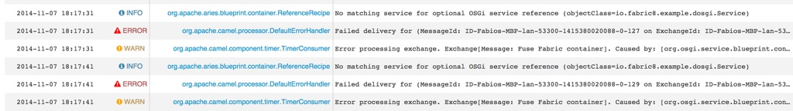

Esempio DOSGI (CXF Distributed OSGI):
===

I profili da utilizzare sono:

1. example-dosgi-camel
1. example-dosgi-camel.provider
1. example-dosgi-camel.consumer

Io ho suddiviso i profili sopra elencati in due container:
+ Container dosgi-provider
    - example-dosgi-camel.provider
+ Container dosgi-consumer
    - example-dosgi-camel
    - example-dosgi-camel.consumer


Dentro il container dosgi-consumer viene attivata una rotta camel che ogni 10 secondi chiama il servizio dosgi messo a
disposizione dal provider e scrive nel log il messaggio modificato dal servizio.

``` xml
    <reference id="myService" interface="io.fabric8.example.dosgi.Service" availability="optional"/>

    <route customId="true" id="fabric-client">
        <from uri="timer://foo?fixedRate=true&amp;period=10000"/>
        <setBody id="setBody1">
            <constant>Fuse Fabric container</constant>
        </setBody>
        <bean ref="myService" method="messageFrom" id="bean1"/>
        <log message="&gt;&gt;&gt; Response from : ${body}" id="log1"/>
    </route>
```

Il servizio viene messo a disposizione dal provider tramite il blueprint:

``` xml
    <bean id="myService" class="io.fabric8.example.dosgi.impl.ServiceImpl"/>

    <service ref="myService" auto-export="interfaces">
        <service-properties>
            <entry key="service.exported.interfaces" value="*"/>
        </service-properties>
    </service>
```

Nel caso di indisponibilità del servizio, causa indisponibilità del provider, nel log del consumer viene rilevato un errore.
