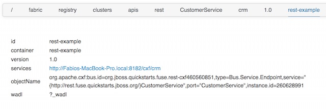

Esempio per esporre un servizio ReST tramite CXF
===

Il profilo da utilizzare è:

1. example-quickstarts-rest

I codici sorgente di questo profilo si possono trovare nella cartella quickstarts di jboss-fuse.

Questo esempio espone un API rest attraverso il servizio di CXF. L'immagine riporta la vista dei metadati della API esposta, visibili da zookeeper.

Nella pagina delle API si può giocare un pochino col servizio ReST invocando direttamente i metodi esposti, ma l'interfaccia grafica
ogni tanto fa comparire dei balloon di errore anche se la chiamata è avvenuta con successo.

I metodi DELETE e PUT da interfaccia grafica non funzionano, restituiscono 405.

Il quickstart suggerisce di lanciare i seguenti comandi CURL per verificare l'applicativo (corretti e testati):

  * Verificare l'url di base con API o registry

          Dovrebbe essere simile a http://localhost:8182/cxf/crm

  * Create a customer

          curl -v -X POST -d "{\"name\": \"Jack Sparrow\"}" -H "Content-Type: application/json" http://localhost:8182/cxf/crm/customerservice/customers

  * Retrieve the customer instance with id 123

          curl -v http://localhost:8182/cxf/crm/customerservice/customers/123

  * Update the customer instance with id 123

          curl -v -X PUT -d "{\"id\": 123, \"name\": \"Mary Sparrow\"}" -H "Content-Type: application/json" http://localhost:8182/cxf/crm/customerservice/customers

  * Delete the customer instance with id 123

           curl -v -X DELETE http://localhost:8182/cxf/crm/customerservice/customers/123
