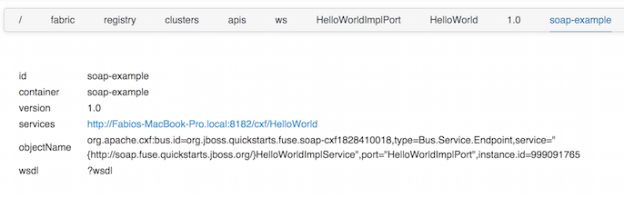

Esempio per esporre un WebService tramite CXF
===

Il profilo da utilizzare è:

1. example-quickstarts-soap

I codici sorgente di questo profilo si possono trovare nella cartella quickstarts di jboss-fuse.

Questo esempio espone un API ws attraverso il servizio di CXF.
L'immagine riporta la vista dei metadati della API esposta, visibili da zookeeper.

Nella pagina delle API si possono vedere le operazioni esposte con una veste grafica interessante oppure andare direttamente al
link del wsdl.

Accedendo da CLI al container dove è deployato il WebService è possibile lanciare il comando _cxf:list-endpoints_

    JBossFuse:karaf@example-soap> cxf:list-endpoints

    Name                      State      Address                                                      BusID
    [HelloWorldImplPort     ] [Started ] [http://localhost:8181/cxf/HelloWorld                   ] [org.jboss.fuse.examples.soap-cxf2040055609]

Utilizzando SOAPUI è possibile richiamare il servizio esposto. Può risultare interessante il log per far vedere il transito del
messaggio.
